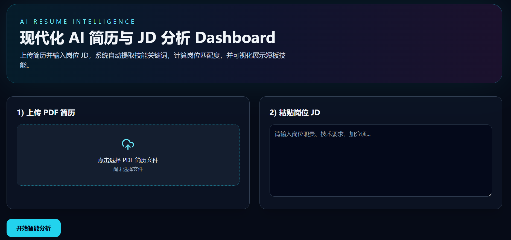
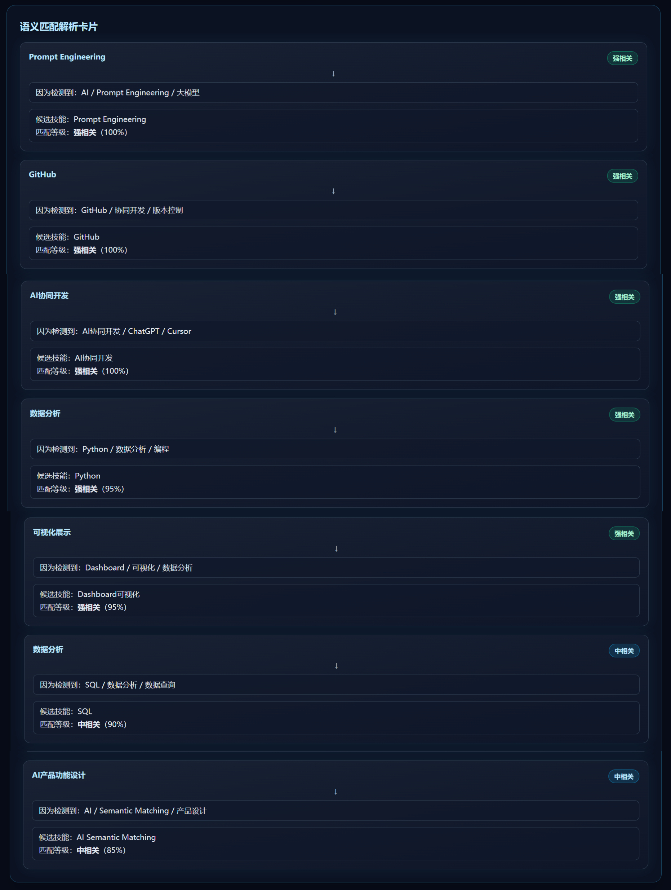
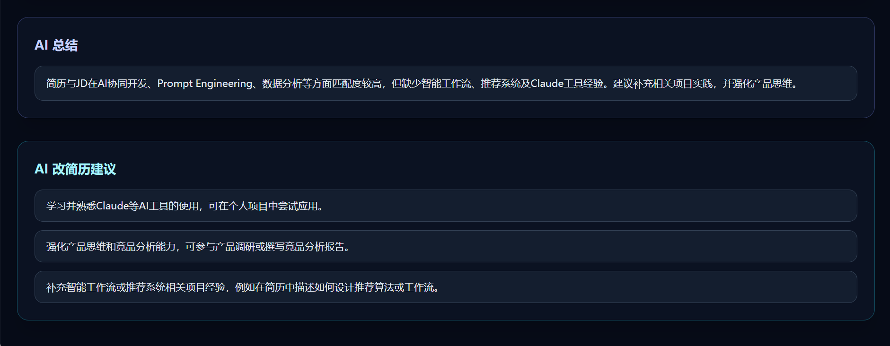

# AI 简历与岗位 JD 智能语义分析平台

基于 AI Semantic Matching 的简历与岗位 JD 智能匹配分析平台，支持技能缺口分析、语义匹配、AI 简历优化建议与可视化展示。

---

# 项目预览

## 首页

---

## 语义匹配分析

---

## AI 改简历建议

---

# 项目功能

- 简历与岗位 JD 智能语义匹配
- AI 技能缺口分析
- Dashboard 数据可视化
- AI 简历优化建议
- Prompt Engineering 工作流
- 本地 AI 分析平台

---

# 技术栈

- React
- Flask
- DeepSeek API
- Prompt Engineering
- GitHub

---

# 项目亮点

- 从传统关键词匹配升级为 AI Semantic Matching
- 基于 Prompt Engineering 提升岗位与简历匹配准确度
- 支持 Resume Skills / Missing Skills 分析
- 提供 AI 总结与改简历建议
- 基于 Cursor / ChatGPT 完成 AI 协同开发
